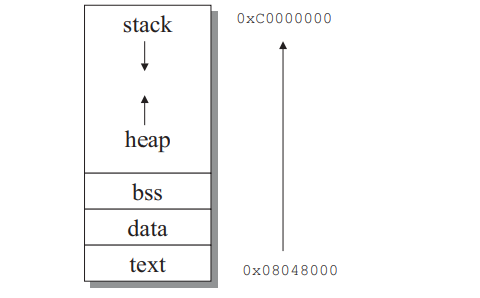

# Stack Overflow et exploitation de buffer Overflows

---

## Table des Matieres

---

Ce cours va s'appuyer sur cet article : 

Les buffers overflows representent 60% des annonces de securites du CERT () de nos jours.Le buffer overflow est le vecteur d'attaque le plus courant dans les intrusions systemes et particulierement dans les attaques a distance.
Des estimations indiquent que pour 1000 lignes de code, il y a entre 5 et 15 erreurs, ce cours va detailler tout d'abord l'organisation memoire de la stack, les potentielles exploitations des failles et quelques conseils pour eviter l'exploitation des buffer overflows.

## ELF et memoire virtuelle

memoire virtuelle : chaque programme quand il est execute obtient un espace memoire entierement isole.la memoire est adresse par mots (4 octets) et elle commence a l'adresse 0x00000000  et finit a l'adresse 0xffffffff , soit 4 Go adressables.Linux utilise pour les programmes executables le format ELF (Executable Linking Format) qui est compose de plusieurs sections.

L'espace virtuel est divise lui meme en 2 zones :
- l'espace user (0x0000000 -0xbfffffff)
- l'espace kernel (0xc0000000 - 0xfffffff)

Un processus user ne peut pas acceder a l'espace kernel mais l'inverse est possible.

Un exécutable ELF est transformé en une image processus par le program loader. 
Pour créer cette image en mémoire, le program loader va mapper en mémoire tous les loadable segments de l'exécutable et des librairies requises au moyen de l'appel système mmap(). Les exécutables sont chargés à l’adresse mémoire fixe 0x08048000 appelée « adresse de base ».

La figure suivante indique les sections principales d'un programme en memoire.La section .txt represente le code du programme.Dans la section .data sont placees les variables globales initialisees (elles sont connues a la compilation) et dans la section .bss les variables globales non-initialisees.

La stack contient les variables locales automatiques (une variable locale est automatique).Elle fonctionne sur le principe LIFO, et la stack croit vers les adresses basses, cad on commence par ex a 0xc0000000 et apres on decsend a ..... .A l'execution d'un programme, les arguments ainsi que les variables d'env sont egalement stockees dans la pile.Et les variables allouees dynamiquement (malloc, calloc...) sont stockees dans la heap. (les adresses croissent)



Exemple :

```c
int var;                        // bss
char var2[] = "buf1";           // data

int main()
{
    static int var3;                // bss
    char *var4                      // stack
    char *var5 = malloc(32);        // heap
    static char var6[] = "buf2";    // data
}
```

La commande size permet de connaitre les differentes sections d'un programme ELF et de leur adresse memoire

```bash
section size addr
.interp 0x13 0x80480f4
.note.ABI-tag 0x20 0x8048108
.hash 0x258 0x8048128
.dynsym 0x510 0x8048380
.dynstr 0x36b 0x8048890
8/92
.gnu.version 0xa2 0x8048bfc
.gnu.version_r 0x80 0x8048ca0
.rel.got 0x10 0x8048d20
.rel.bss 0x28 0x8048d30
.rel.plt 0x230 0x8048d58
.init 0x25 0x8048f88
.plt 0x470 0x8048fb0
.text 0x603c 0x8049420
.fini 0x1c 0x804f45c
.rodata 0x2f3c 0x804f480
.data 0xbc 0x80533bc
.eh_frame 0x4 0x8053478
.ctors 0x8 0x805347c
.dtors 0x8 0x8053484
.got 0x12c 0x805348c
.dynamic 0xa8 0x80535b8
.sbss 0x0 0x8053660
.bss 0x2a8 0x8053660
.comment 0x3dc 0x0
.note 0x208 0x0
Total 0xade9
```
(Des informations similaires mais plus détaillées peuvent être obtenues avec les
commandes readelf –e ou objdump -h). Nous voyons apparaître l’adresse en mémoire
et la taille (en bytes) des sections qui nous intéressent : .text, .data et .bss. 

## Appel d'une fonction en assembleur

C'est maintenant l'occasion de faire une mini parenthese sur comment est appelee une fonction en assembleur car cela sera utile pour la suite.

### Les registres %eip %ebp et %esp

#### %eip

Extended Instrucion Pointer : c'est le curseur du CPU, il indique quelle instruction executer avec un pointeur sur la suivante.Le CPU fait la boucle suivante : lire instruction a %eip --> executer --> %eip++

#### %esp

Extended Stack Pointer : il pointe toujours vers le sommet de la stack, il bouge a chaque push (ajout) ou pop (suppression) sur la stack. On rappele ici que la stack grandit en decrementant les adresses.

#### %ebp

Extended Base Pointer : c'est le point de repere fixe de la fonction, il permet de retrouver ou sont les varaibles et les parametres.Il reste stable pendant toute l'execution de la fonction.

### appel de la fonction

#### Prologue de la fonction

#### Epilogue de la fonction

#### Rapport avec les buffers overflows

Si on deborde d'un buffer local, on remonte dans la pile :

```
%esp → [sommet actuel]
       [buffer local]     ← débordement ici...
       [autre variable]   
       -------------------
%ebp → [ancien %ebp]       ← écrase ça...
       [adresse retour]    ← puis ÇA !
       [paramètres]
```

--> Consequence ici, le retour de la fonction est modifie ce qui peut crasher le programme ou executer une autre fonction pour prendre le controle de l'ordinateur.

## Exemple de Stack overflow

Quand on place dans un espace memoire plus de donnee qu'il ne peut en contenir, on cree un buffer overflow. Ici nous allons voir le cas avec un buffer non-alloue donc sur la stack.Les donnees mises en trop sont quand meme inserees en memoire meme si elles ecrasent des donnees qu'elles ne devraient pas.Nous allons voir dans cet exemple que si on ecrase certaines donnees on peut arriver a prendre le controle du programme.Voici un exemple de code vunerable :

```c
#include <stdio.h>

int main(int ac, char **av)
{
	char buffer[256];

	if (ac > 1)
		strcpy(buffer, av[1]);
}
```

Ce programme ne fait rien de plus de prendre le premier argument envoye a ce programme et le placer dans le buffer avec l'appel a la fonction strcpy.Seulement, a aucun moment du programme on regarde la taille de av[1] pour que cette taille soit inferieure a celle du buffer.Un probleme arrive lorsque l'utilisateur donne un argument plus grand que la taille du buffer :
```bash
➜ /a.out "$(python3 -c "print('A'*300)")"
[1]    1678256 segmentation fault (core dumped)  ./a.out "$(python3 -c "print('A'*300)")"
➜  
```

Pour mieux comprendre ce segfault, nous allons regarder au niveau des fichiers core cree a la fin d'un segfault :
```bash
coredumpctl gdb a.out

```

ici nous ouvrons avec gdb le coredump de cet executable apres l'avoir execute:

```bash
       Message: Process 1675463 (a.out) of user 44516092 dumped core.
                
                Stack trace of thread 1675463:
                #0  0x00000000004004ad main (/home/miouali/Documents/essai_de_codes/a.out + 0x4ad)
                #1  0x4141414141414141 n/a (n/a + 0x0)
                ELF object binary architecture: AMD x86-64
```
